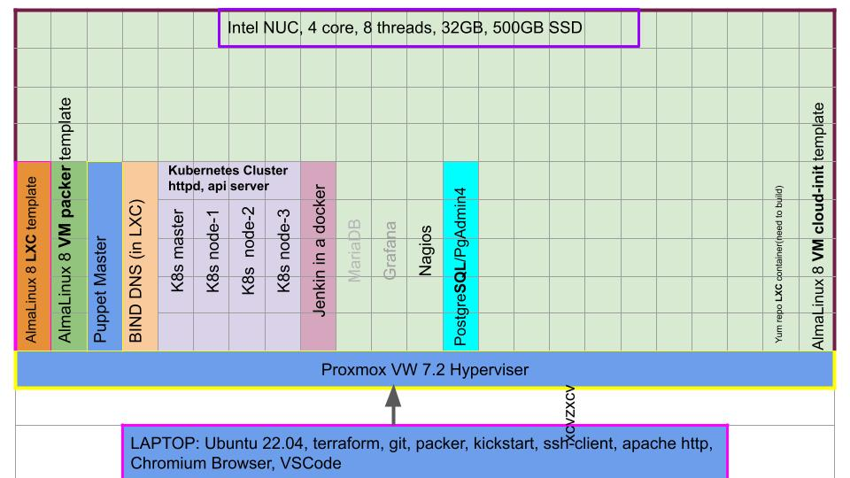
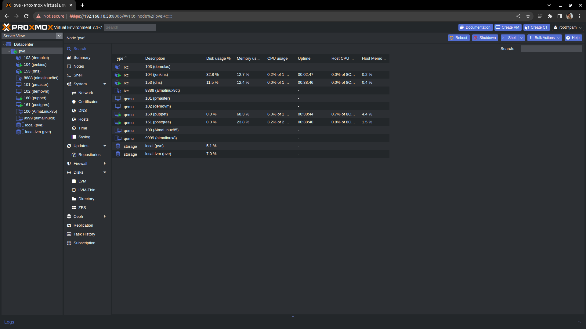

# Homelab
VMs, LXC container, kubernetes in the Homelab learning environment

# Diagram


# Hardware
Choose fasted SSD if plan to run high number of VMs
* [NUC11PAHi50000](https://ark.intel.com/content/www/us/en/ark/products/205040/intel-nuc-11-performance-kit-nuc11pahi5.html) Intel Core i5-1135G7 @ 2.40GHz, Quad Core, 8 Threads
* 1x 32GB DDR4-3200MHz
* SAMSUNG 980 PCIE 3.0 NVME M.2 500GB SSD

# Proxmox
Install [Proxmox VE](https://www.proxmox.com) (pve) Open Source Server Management platform. It provides:
1. KVM Hyperviser
1. Linux Containers (LXC)
   
**why?** it takes 1GB memory (ESXi may take 10GB) and does what you need for Home setup. Watch LearnLinuxTV [YouTube Playlist](https://www.youtube.com/watch?v=LCjuiIswXGs&list=PLT98CRl2KxKHnlbYhtABg6cF50bYa8Ulo) for quick details.

**Customization**
- [Install Dark Theme](https://github.com/Weilbyte/PVEDiscordDark)
- [Remove Proxmox Subscription Notice](https://johnscs.com/remove-proxmox51-subscription-notice/)


# First VM - Manual

### Create VM
Create a VM with 16GB disk, 2GB RAM and leaving everything default. 

### OS Installation
- Download AlmaLinux 8.5 minimal iso image and use url in 'ISO Images' tab of local (pve) storage to dowunlaod ISO
- Attach iso to above created VM's virtual CD. STart VM. install minimal OS.
- create a local user `user` while installing
- Once installation completes, remove iso image from CD by choosing - do not use any media, and reboot
  - post reboot:
    - check if vNIC is UP and have an DHCP address. If not, check and update `grep -E "PROTO|ONBOOT" /etc/sysconfig/network-scripts/ifcfg-*` and bringup vNIC `ifup ensNN`
    - Add a serial port on VM `qm set VMID -serial0 socket`
    - ssh to VM, set existing kernel options, append serial port config, recheck it. See [this(https://access.redhat.com/articles/7212#config8)]
        ```bash
        grub2-editenv - list | grep kernelopts
        grub2-editenv - set "$(grub2-editenv - list | grep kernelopts) console=tty0 console=ttyS0,115200"
        grub2-editenv - list | grep kernelopts
        ```
     - reduce grub menu wait time
        ```bash
        sed -i 's/^GRUB_TIMEOUT.*/GRUB_TIMEOUT=1/g' /etc/default/grub
        grub2-mkconfig -o /boot/grub2/grub.cfg
            OR
        grub2-mkconfig -o /boot/efi/EFI/redhat/grub.cfg
        ```
    - add a serial port to connect using qm termninal VMID
    - update grub default

Note: if DNS resolve is not working, comment nameserver line and add `nameserver 8.8.8.8` in /etc/resolv.conf and run `systemctl restart systemd-resolved`

---

# Puppet

**DIR/FILE:** ./terraform/puppet & /puppet_code/production/my_modules
Puppet master VM build and installation is done by terraform. Code is [here](terraform/puppet/main.tf)

Refer [this](https://puppet.com/docs/puppet/7/install_and_configure.html) for puppetserver and agent installtion and configuration.
* Adjust memory size in JAVA_ARGS in /etc/sysconfig/puppetserver if puppetserver fails to start

Puppet master VM build and installation is done by terraform. Code is [here](terraform/puppet/main.tf)
**DIR/FILE:** /puppet_code/production/my_modules/

./bind_dns/ : puppet to to install and configure BIND DNS on LXC container


TODO: Find how to install puppet agent on each VM and Container at creation time and configure it.

```bash
rpm -Uvh https://yum.puppet.com/puppet7-release-el-8.noarch.rpm
#yum install -y puppetserver
yum install -y puppet-agent
```

**Puppet agent certificate regeneration**
* On agent as per [this](https://puppet.com/docs/puppet/7/ssl_regenerate_certificates.html)
  ```
  puppet resource service puppet ensure=stopped
  rm -rf $(puppet config print ssldir --section agent)
  puppet resource service puppet ensure=running
  ```
* On puppet master
  ```
  puppetserver ca list --all
  puppetserver ca clean --certname <agent.cert.name>
  puppetserver ca clean --certname <agent.cert.name>
  puppetserver ca list #anything pending?
  puppetserver ca sign --certname <agent.cert.name>
  ```

# QEMU Guest Agent
Enable QEMU Guest Agent option under Options of VM and do following
```bash
yum install -y qemu-guest-agent
yum update -y
# stop VM and then run these
systemctl enable --now qemu-guest-agent
systemctl start  qemu-guest-agent
```
It is being installed on each VM and LXC containser via terraform at build time.

Puppet will ensure it it running all time.

# cloud-init

**DIR/FILE:** ./cloudinit/cloud.cfg

  
Sample config file used in the setup.
NOTE: cloud-init drive must be atttache to pass variable to host!

```bash
yum install cloud-init -y
rm -f /etc/ssh/ssh_host_*
truncate -s 0 /etc/machine-id
ln -fs /etc/machine-id /var/lib/dbus/machine-id
rm -rf /usr/share/man/* /usr/share/doc/*  /usr/share/locale/*
```

[cloud-init](https://cloudinit.readthedocs.io/en/latest/) is a set of init scripts to handles early initialization of VM instance.

* Regenerate unique hosts key of VM on first boot
* Parse external user data passed to the instance along with its launch

Most linux distribution provides cloud-init image designed for OpenStack that can be use with PVE to spin a VM.

But better to make our own cloud-init image, so it was done.

Update `/etc/cloud/cloud.cfg` as per you need and cloud-init [module reference](https://cloudinit.readthedocs.io/en/latest/topics/modules.html)

Add a cloudinit drive using below command or Click CloudInit Drive under Add of Hardware section.
```bash
nano /etc/cloud/cloud.cfg
cloud-init clean
qm set VMID --ide2 local-lvm:cloudinit
#Finally
cloud-init init
```
Watch [Getting Started with cloid-init](https://www.youtube.com/watch?v=exeuvgPxd-E)

### Clean and sutdown
Finally, shutdown to create tempate from this VM
```bash
yum clean all && rm -rf /var/cache/yum
shutdown -h
```

### Create Template
Right click on shutdown VM and click on conver to template.

### Clone to make new hosts
Replace hostname in following files
```bash
nano /etc/hosts
nano /etc/hostname
```
---

# kickstart
**DIR/FILE:** ./kickstart/almalinux_8_ks.cfg

Alamalinux(Redhat Linux) automatically created /root/anaconda-ks.cfg on installation. Taken file from above VM and modified little bit to create image using packer (below section). kickstart reference doc is [here](https://access.redhat.com/documentation/en-us/red_hat_enterprise_linux/8/html/performing_an_advanced_rhel_installation/kickstart-commands-and-options-reference_installing-rhel-as-an-experienced-user).
* add public key ro root and normal user `user`
* add hosts entry for puppet master and install puppet agent (zzz are we doing it via terraform?)

Check kickstart file for any syntax error (it does not check logical error)
```
yum install -y pykickstart
ksvalidator -v RHEL8 <ks-file.cfg>
```


# Hashicorp Packer
**DIR/FILE:** ./packer/
Packer is a tool to install a VM and pack newly installed VM to an image in one command - hence packer. Installation is well documented. [This](https://www.packer.io/plugins/builders/proxmox/iso) document has details of valiables to create image from iso. 

* refer code in above directory
* packer will start a temp http on random unused port higher than 8000 to host kiskstart file during installtion. port can be checked using: `sudo netstat -nlp |grep packer`
* known issues
  * use value of `node` variable same as dir name present in /etc/pve/nodes directory to eliminate error 596 tls_process_server_certificate. Add a local hosts entry to resolve IP to the node name
  * if OS installation on VM is starting but not able to find sda disk, define scsi_controller packer varible to virtio-scsi-pci
  * Waiting for SSH to become available - 
* few commands
  ```
  packer validate .
  packer init
  packer build -debug -force .
  packer build -force .
  ```
  
  In 8 minutes, VM was installed and template was created!
  ```bash
  nasim@nau22:~/git/homelab/packer$ packer build -force .
  build Alamninux 8 template.proxmox.myproxmox: output will be in this color.

  ==> build Alamninux 8 template.proxmox.myproxmox: Creating VM
  ==> build Alamninux 8 template.proxmox.myproxmox: Starting VM
  ==> build Alamninux 8 template.proxmox.myproxmox: Starting HTTP server on port 8652
  ==> build Alamninux 8 template.proxmox.myproxmox: Waiting 10s for boot
  ==> build Alamninux 8 template.proxmox.myproxmox: Typing the boot command
  ==> build Alamninux 8 template.proxmox.myproxmox: Waiting for SSH to become available...
  ==> build Alamninux 8 template.proxmox.myproxmox: Connected to SSH!
  ==> build Alamninux 8 template.proxmox.myproxmox: Stopping VM
  ==> build Alamninux 8 template.proxmox.myproxmox: Converting VM to template
  Build 'build Alamninux 8 template.proxmox.myproxmox' finished after 7 minutes 39 seconds.

  ==> Wait completed after 7 minutes 39 seconds

  ==> Builds finished. The artifacts of successful builds are:
  --> build Alamninux 8 template.proxmox.myproxmox: A template was created: 9999
  nasim@nau22:~/git/homelab/packer$ 
  ```
---  
# Proxmox LXC Container Template
LXC container by default does not have ssh server enabled. 

Create your own template with ssh server installed and enabled so that terraform can use remote-exec provider to do post creation steps after creating new LXC container after cloning it.

* Create a container almalinux8ct using `Create CT`
* choose all default option
* Power it on
* Add an IP address and install ssh server
```bash
ip addr add 192.168.10.99 dev eth0@if13
ip route add 192.168.10.1 dev eth0
ip route add default via 192.168.10.1
ip link set eth0 up
dnf update -y
dnf -y install openssh-server net-tools
/usr/bin/systemctl enable sshd
sed -i 's/^PasswordAuthentication.*/PasswordAuthentication yes/g' /etc/ssh/sshd_config
rm -f /etc/ssh/ssh_host_*
truncate -s 0 /etc/machine-id
ln -fs /etc/machine-id /var/lib/dbus/machine-id
yum clean all
date > /etc/birth_certificate
shutdown -h 0
```
* Right click on LXC container and "Conver to Template"

# Hashicorp Terraform
**DIR/FILE:** ./terraform/shared/
This one had common variable that can be consumed by other terraform module - such as ssh public ket and credential of proxmox VE

**DIR/FILE:** ./terraform/puppet/
A workspace that will build a Puppet Master VM using template image created by Packer. It will install puppetserver and puppet-agent via `remote-exec` provisioner.


# BIND DNS
**DIR/FILE:** ./puppet_code/production/my_modules/bind_dns/manifests/bind_dns.pp

**Why bind?** Because I have worked on this extensively in my previous role.

Puppet code will install required rpms and copy config files from files directory of the module.

It is hosting family.net forward and reverse zone. Running on LXC container instead VM as it has one and only one simple job to do.

Reference document [here](https://opensource.com/article/17/4/build-your-own-name-server)
---

# kubernetes
**DIR/FILE:** ./terraform/kubernetes/
Terraform will provision a master and 2 nodes using configuration [here](./terraform/kubernetes/)
TODO: certificate creation and node join

# PostgreSQL
**DIR/FILE:** ./terraform/postgres/
Run basic PostgreSQL create test DB and run commands via PgAdmin4

# MySQL
TODO

# Jenkins
**DIR/FILE:** ./jenkins
Run Jenkins in a docker image in a VM running AlmaLinux.

# Final Section
## References
 
* [PVE documentataion](https://pve.proxmox.com/pve-docs/)

## Credit
  * [David Cooper](https://www.linkedin.com/in/david-cooper-8a57031/) for sharing knowledge
  * [LearnLinuxTV](https://www.youtube.com/watch?v=LCjuiIswXGs&list=PLT98CRl2KxKHnlbYhtABg6cF50bYa8Ulo) Proxmox Playlist

## My Proxmox VE

